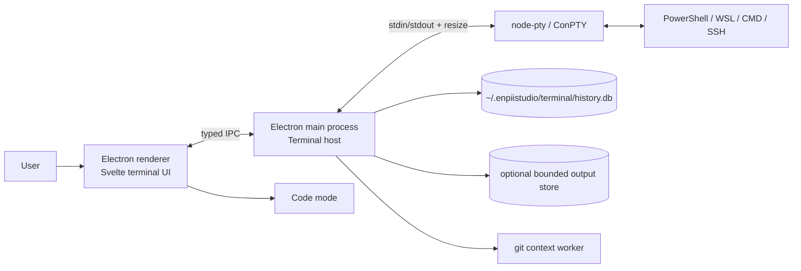
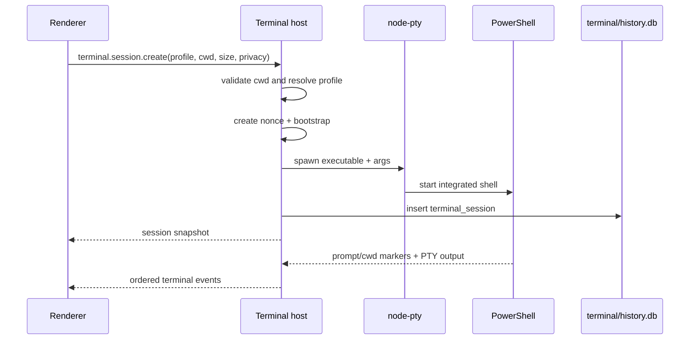
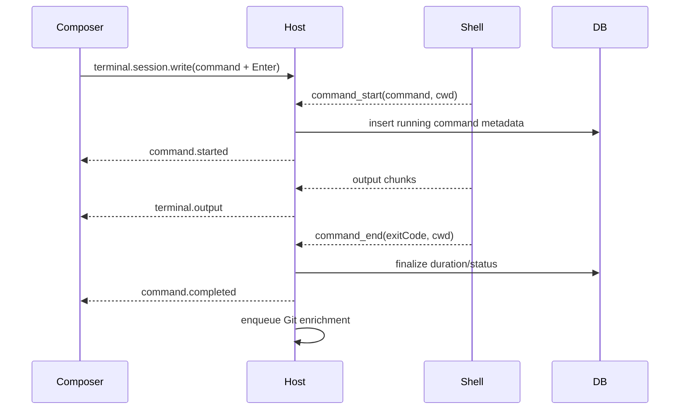

# Terminal Architecture

Status: proposed
Date: 2026-08-04

## 1. Context

The terminal is part of the existing Electron desktop application. The repository already runs `node-pty` in the Electron main process and renders each session with xterm.js in Svelte. The new design retains those boundaries and adds a structured command protocol, a block projection, durable history, and graceful classic-mode fallback.

## 2. Design decisions

| Decision | Choice | Reason |
|---|---|---|
| Shell execution | Existing `node-pty` + platform PTY | Required for real shell semantics and interactive programs |
| Terminal emulation | Existing xterm.js | Mature ANSI/VT behavior and alternate-screen compatibility |
| Block representation | Projection of PTY events | Does not fork shell semantics or break child processes |
| First integrated shell | PowerShell 7 | Primary Windows target and reliable per-session bootstrap |
| Persistence | Desktop-owned `~/.enpiistudio/terminal/history.db` | Avoids coupling terminal writes to the agent sidecar's session index |
| Output storage | Bounded optional chunks | Prevents unbounded database growth and limits secret exposure |
| Shell bootstrap | Temporary generated script | Avoids modifying the user's permanent profile |
| Failure behavior | Per-session classic mode | Terminal remains usable when integration is unsupported |
| File editing | Existing Code mode | Avoids duplicating editor responsibilities |

## 3. System boundary



Trust boundaries:

- Renderer input is untrusted and validated by the host.
- PTY output is untrusted terminal data and must not become HTML.
- Shell integration markers are advisory metadata from the child process, not authorization.
- Terminal commands are user-driven and are separate from agent tool approvals.
- History may contain secrets and receives stricter persistence rules than ordinary UI state.

## 4. Logical components

### 4.1 Terminal workspace controller — renderer

Owns project-scoped UI state:

- tabs and split panes;
- active/focused session;
- transcript viewport and virtualization;
- composer/editor state;
- history panel;
- xterm attachment point for running/interactive content;
- classic-mode diagnostics.

It does not own the PTY or write directly to SQLite.

### 4.2 Terminal session host — Electron main

Owns process state that must survive renderer reload:

- spawn, write, resize, interrupt, and kill;
- shell profile resolution;
- bootstrap generation and cleanup;
- marker parsing and event sequencing;
- bounded raw-output buffers;
- persistence queue;
- Git context enrichment;
- renderer subscription/replay.

This evolves the existing terminal map in `apps/desktop/electron/main.ts` into a dedicated module before feature growth makes the main file harder to maintain.

### 4.3 Shell profile registry

A shell profile declares:

```ts
interface ShellProfileDefinition {
  id: string
  label: string
  executable: string
  args: string[]
  integration: 'powershell' | 'bash' | 'none'
  environment?: Record<string, string>
  classicByDefault?: boolean
}
```

The registry resolves executables in the host process. User-provided executable paths must be absolute or resolved through a bounded PATH lookup. Arguments are arrays; they are not concatenated into a host shell command.

### 4.4 Shell integration bootstrap

For PowerShell 7, EnStudio creates a temporary script under the application's runtime/temp directory and starts:

```text
pwsh -NoLogo -NoExit -File <bootstrap.ps1>
```

The bootstrap:

1. loads the user's normal PowerShell profile unless disabled by profile settings;
2. wraps the prompt without replacing its visible content;
3. emits versioned OSC markers for prompt boundaries, cwd, command boundaries, and completion;
4. preserves PSReadLine and native terminal behavior;
5. uses a random per-session nonce in every marker;
6. removes no user aliases/functions and changes no permanent files.

If profile loading throws or the bootstrap cannot install hooks, it emits an integration-error marker and starts an ordinary usable prompt.

### 4.5 Protocol parser — host

The host parses EnStudio's private OSC protocol before broadcasting output. It removes recognized integration frames from visible output and emits structured events.

Proposed wire form:

```text
ESC ] 633 ; EnStudio ; 1 ; <nonce> ; <event> ; <base64url-json> BEL
```

Fields:

- `633`: OSC family compatible with shell-integration conventions;
- `EnStudio`: private discriminator;
- `1`: protocol version;
- `nonce`: random value assigned by the host;
- `event`: `prompt_start`, `prompt_ready`, `command_start`, `output_start`, `command_end`, `cwd`, `integration_error`;
- payload: UTF-8 JSON encoded as base64url.

Parser requirements:

- handle markers split across arbitrary PTY chunks;
- handle multiple markers in one chunk;
- cap an incomplete marker buffer at 64 KiB;
- require exact protocol version and nonce;
- treat invalid frames as ordinary terminal text or degrade after repeated errors;
- preserve ordering by assigning a monotonic sequence number in the host;
- never parse marker payload as HTML or executable code.

### 4.6 Block projection — renderer

The renderer consumes ordered events and builds a projection:

```text
prompt_ready
  -> command_start
  -> zero or more output chunks
  -> command_end
  -> prompt_ready
```

The PTY/xterm stream remains available as the compatibility truth. The block projection stores display-safe text/ANSI references and metadata. It never sends a command by executing HTML or by invoking a system shell directly.

### 4.7 History repository — host

The repository writes terminal records to `~/.enpiistudio/terminal/history.db` through a serialized queue. The Electron main process is the sole owner of this connection. It does not reuse the agent sidecar's current `sessions/index.db`, which has a different lifecycle and data owner.

Responsibilities:

- start/end session rows;
- create/finalize command rows;
- apply retention and privacy policy;
- store bounded optional output;
- run parameterized search;
- redact before persistence;
- delete and vacuum according to explicit user actions/maintenance policy.

Database writes are not on the PTY output hot path. A bounded queue drops optional output before it drops command metadata.

### 4.8 Git context worker — host

Git context is enrichment, never a command prerequisite.

- Trigger after cwd changes and command completion.
- Cache by canonical repository root plus head/index timestamps.
- Execute with argument arrays and bounded timeout.
- Return `unknown` on failure without surfacing noisy terminal output.
- Do not run recursively for commands already operating inside Git hooks unless requested by the UI.

## 5. Data flow

### 5.1 Create a session



### 5.2 Run a normal command



### 5.3 Continued input

When the prompt is not ready, the composer changes into input-forwarding state. Data is sent to the existing PTY and remains within the running block. EnStudio does not create another command row unless the shell emits a new `command_start` marker.

### 5.4 Alternate-screen program

xterm detects DEC private-mode changes such as alternate-screen entry. The renderer reveals the xterm compatibility surface for that block/pane. The host protocol remains unchanged. On alternate-screen exit, the renderer hides the surface and resumes the block transcript. If the shell integration also returns to `prompt_ready`, the composer returns to command mode.

## 6. Renderer recovery

The host maintains a bounded event journal per live session:

- latest session snapshot;
- active command metadata;
- recent ordered events needed to reconstruct the visible tail;
- xterm-compatible output tail, bounded by bytes.

After renderer reload:

1. renderer lists live sessions for the active project;
2. renderer subscribes with its last acknowledged sequence number;
3. host replays available events;
4. if the sequence is older than the retained journal, host sends a fresh snapshot and marks missing output as truncated;
5. the PTY remains alive throughout.

## 7. Classic-mode fallback

A session enters classic mode when:

- the profile declares no integration;
- bootstrap installation fails;
- marker parsing exceeds its error threshold;
- the user explicitly selects classic mode.

Classic mode:

- renders the xterm surface as today;
- preserves tabs, panes, SSH, input, resize, and clipboard;
- may save session-level metadata but MUST NOT claim exact command boundaries;
- MAY import shell-native history later, but not as if it were an observed EnStudio command block.

The user can retry integration by starting a new session; mutating a running shell's integration state is avoided in the first implementation.

## 8. Failure modes and mitigations

| Failure | Behavior | Mitigation |
|---|---|---|
| `pwsh` missing | Profile unavailable | Offer another installed profile/classic mode |
| Bootstrap/profile error | Shell still opens | Diagnostic block and classic-mode fallback |
| Marker split/corrupt | Parser buffers/rejects | Bounded state machine, nonce and version validation |
| Database locked/corrupt | Terminal remains live | Disable persistence, notify once, allow repair/export later |
| Renderer crash/reload | PTY remains live | Host ownership and event replay |
| Output flood | UI/database pressure | Incremental render, transcript virtualization, bounded persistence |
| Git command slow | No prompt delay | Worker timeout and cache |
| cwd deleted | Rerun cannot use original cwd | Explain and use current cwd only after confirmation |
| Hidden input | Secret disclosure | Disable echo/capture and never persist hidden input |
| PTY exits unexpectedly | Block incomplete | Finalize active block as `unknown` or `terminated` |
| App quits with live PTYs | Child leak/data loss | Graceful shutdown deadline, then kill process trees |

## 9. Security and privacy

- Keep `contextIsolation` and preload APIs; renderer receives no `node-pty` object.
- Validate IPC payload shape, session ownership, project association, cwd, dimensions, and maximum write size.
- Use parameterized SQLite statements.
- Store no API keys or shell credentials in terminal history.
- Treat commands and output as text; use xterm for terminal rendering and escaped DOM text for transcript rendering.
- Use a per-session marker nonce to avoid accidental marker spoofing. A process inside the PTY can still print a copied valid marker, so markers are metadata only and never authorize host actions.
- Redaction is defense in depth, not a guarantee. Private mode is the reliable choice for sensitive work.
- History deletion must remove database rows and output chunks; SQLite secure deletion/compaction behavior should be documented rather than overstated.
- Ordinary user terminal sessions MUST NOT receive provider API keys. The existing provider-environment injection path is reserved for explicitly launched vendor/agent CLI sessions and should remain a separate launch capability.
- Agent features must receive terminal text only after an explicit user action and a visible preview.

## 10. Operability

Structured host logs may record:

- session id, profile id, lifecycle transitions;
- integration version and degraded-mode reason;
- parser error count;
- persistence queue depth and failures;
- output truncation counts;
- Git enrichment duration.

Logs MUST NOT contain raw command text, terminal output, environment variables, nonce, or hidden input by default.

Useful local diagnostics:

- copy session diagnostics without command/output;
- restart session in classic mode;
- reveal selected shell profile and executable;
- show whether history/output persistence is active.

## 11. Testing strategy

### Unit

- chunk-boundary fuzz tests for the OSC parser;
- block reducer state transitions;
- redaction and private-mode policies;
- history query parser and SQL parameterization;
- bounded output retention;
- cwd/profile validation.

### Integration

- spawn PowerShell fixture and verify marker ordering;
- normal command, non-zero command, `Ctrl+C`, multiline command;
- prompt question, REPL, watch process, SSH fixture;
- alternate-screen enter/leave fixture;
- renderer unsubscribe/resubscribe replay;
- database unavailable/degraded persistence.

### Manual compatibility matrix

- PowerShell 7 and Windows PowerShell 5.1;
- Windows 11 ConPTY;
- WSL Bash after P1;
- `npm`, Git, PHP/Composer, Docker CLI, SSH;
- Unicode, emoji, wide characters, ANSI color, hyperlinks;
- tabs, split panes, resize, zoom, copy/paste, project switching.

## 12. Deployment and rollback

- Introduce the new terminal behind `terminal.blocks.enabled` during migration.
- Keep the current classic `TerminalStage` path available until compatibility criteria pass.
- Create the terminal database and schema additively; do not rewrite existing agent/session data.
- On rollback, disable block mode and continue using the same PTY host/classic renderer.
- New terminal tables can remain unused; no destructive database downgrade is required.
